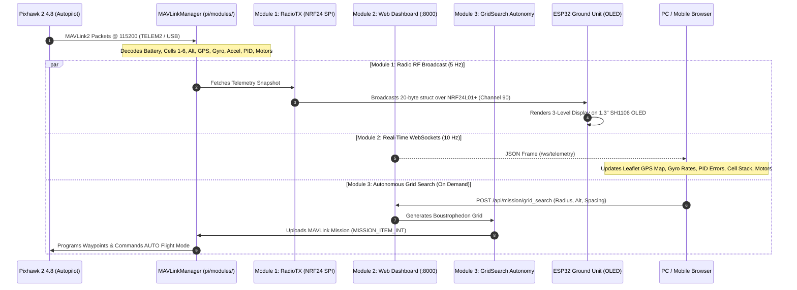

# End-to-End Master Companion Pipeline

```mermaid
sequenceDiagram
    autonumber
    participant Pixhawk as Pixhawk 2.4.8 (Autopilot)
    participant MAV_MGR as MAVLinkManager (pi/modules/)
    participant Radio_Mod as Module 1: RadioTX (NRF24 SPI)
    participant Web_Mod as Module 2: Web Dashboard (:8000)
    participant Grid_Mod as Module 3: GridSearch Autonomy
    participant ESP as ESP32 Ground Unit (OLED)
    participant Browser as PC / Mobile Browser

    Pixhawk->>MAV_MGR: MAVLink2 Packets @ 115200 (TELEM2 / USB)
    Note over MAV_MGR: Decodes Battery, Cells 1-6, Alt, GPS, Gyro, Accel, PID, Motors

    par Module 1: Radio RF Broadcast (5 Hz)
        MAV_MGR->>Radio_Mod: Fetches Telemetry Snapshot
        Radio_Mod->>ESP: Broadcasts 20-byte struct over NRF24L01+ (Channel 90)
        ESP->>ESP: Renders 3-Level Display on 1.3" SH1106 OLED
    and Module 2: Real-Time WebSockets (10 Hz)
        Web_Mod-->>Browser: JSON Frame (/ws/telemetry)
        Note over Browser: Updates Leaflet GPS Map, Gyro Rates, PID Errors, Cell Stack, Motors
    and Module 3: Autonomous Grid Search (On Demand)
        Browser->>Web_Mod: POST /api/mission/grid_search (Radius, Alt, Spacing)
        Web_Mod->>Grid_Mod: Generates Boustrophedon Grid
        Grid_Mod->>MAV_MGR: Uploads MAVLink Mission (MISSION_ITEM_INT)
        MAV_MGR->>Pixhawk: Programs Waypoints & Commands AUTO Flight Mode
    end
```
