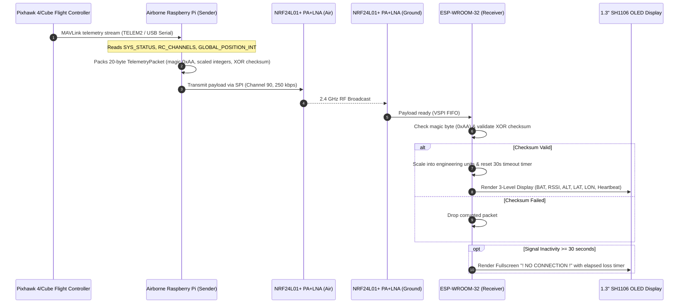

# End-to-End Drone Telemetry Pipeline

```mermaid
sequenceDiagram
    autonumber
    participant Pixhawk as Pixhawk 4/Cube Flight Controller
    participant RPi as Airborne Raspberry Pi (Sender)
    participant NRF_TX as NRF24L01+ PA+LNA (Air)
    participant NRF_RX as NRF24L01+ PA+LNA (Ground)
    participant ESP as ESP-WROOM-32 (Receiver)
    participant OLED as 1.3" SH1106 OLED Display

    Pixhawk->>RPi: MAVLink telemetry stream (TELEM2 / USB Serial)
    Note over RPi: Reads SYS_STATUS, RC_CHANNELS, GLOBAL_POSITION_INT
    RPi->>RPi: Packs 20-byte TelemetryPacket (magic 0xAA, scaled integers, XOR checksum)
    RPi->>NRF_TX: Transmit payload via SPI (Channel 90, 250 kbps)
    NRF_TX-->>NRF_RX: 2.4 GHz RF Broadcast
    NRF_RX->>ESP: Payload ready (VSPI FIFO)
    ESP->>ESP: Check magic byte (0xAA) & validate XOR checksum
    alt Checksum Valid
        ESP->>ESP: Scale into engineering units & reset 30s timeout timer
        ESP->>OLED: Render 3-Level Display (BAT, RSSI, ALT, LAT, LON, Heartbeat)
    else Checksum Failed
        ESP->>ESP: Drop corrupted packet
    end

    opt Signal Inactivity >= 30 seconds
        ESP->>OLED: Render Fullscreen "! NO CONNECTION !" with elapsed loss timer
    end
```
