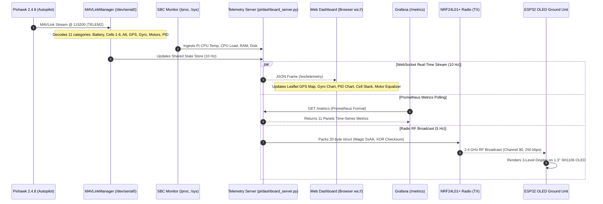

# End-to-End Drone Telemetry & Mission Pipeline

```mermaid
sequenceDiagram
    autonumber
    participant Pixhawk as Pixhawk 2.4.8 (Autopilot)
    participant Pi_Serial as MAVLinkManager (/dev/serial0)
    participant SBC_Mon as SBC Monitor (/proc, /sys)
    participant Hub as Telemetry Server (pi/dashboard_server.py)
    participant Web as Web Dashboard (Browser ws://)
    participant Graf as Grafana (/metrics)
    participant NRF as NRF24L01+ Radio (TX)
    participant ESP as ESP32 OLED Ground Unit

    Pixhawk->>Pi_Serial: MAVLink Stream @ 115200 (TELEM2)
    Note over Pi_Serial: Decodes 11 categories: Battery, Cells 1-6, Alt, GPS, Gyro, Motors, PID
    SBC_Mon->>Hub: Ingests Pi CPU Temp, CPU Load, RAM, Disk
    Pi_Serial->>Hub: Updates Shared State Store (10 Hz)
    
    par WebSocket Real-Time Stream (10 Hz)
        Hub-->>Web: JSON Frame (/ws/telemetry)
        Note over Web: Updates Leaflet GPS Map, Gyro Chart, PID Chart, Cell Stack, Motor Equalizer
    and Prometheus Metrics Polling
        Graf->>Hub: GET /metrics (Prometheus Format)
        Hub-->>Graf: Returns 11 Panels Time-Series Metrics
    and Radio RF Broadcast (5 Hz)
        Hub->>NRF: Packs 20-byte struct (Magic 0xAA, XOR Checksum)
        NRF-->>ESP: 2.4 GHz RF Broadcast (Channel 90, 250 kbps)
        ESP->>ESP: Renders 3-Level Display on 1.3" SH1106 OLED
    end
```
