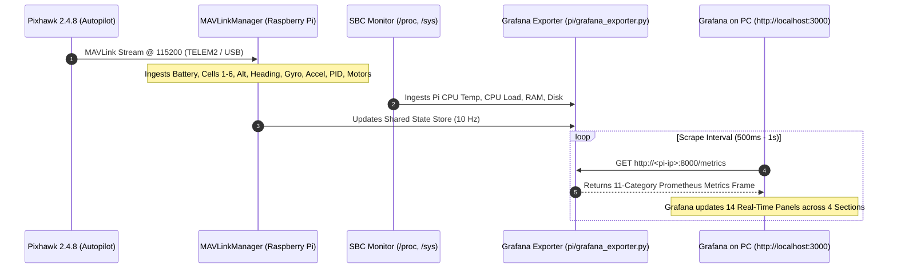

# End-to-End Grafana Telemetry Pipeline

```mermaid
sequenceDiagram
    autonumber
    participant Pixhawk as Pixhawk 2.4.8 (Autopilot)
    participant Pi_Serial as MAVLinkManager (Raspberry Pi)
    participant SBC_Mon as SBC Monitor (/proc, /sys)
    participant Exp as Grafana Exporter (pi/grafana_exporter.py)
    participant Graf as Grafana on PC (http://localhost:3000)

    Pixhawk->>Pi_Serial: MAVLink Stream @ 115200 (TELEM2 / USB)
    Note over Pi_Serial: Ingests Battery, Cells 1-6, Alt, Heading, Gyro, Accel, PID, Motors
    SBC_Mon->>Exp: Ingests Pi CPU Temp, CPU Load, RAM, Disk
    Pi_Serial->>Exp: Updates Shared State Store (10 Hz)
    
    loop Scrape Interval (500ms - 1s)
        Graf->>Exp: GET http://<pi-ip>:8000/metrics
        Exp-->>Graf: Returns 11-Category Prometheus Metrics Frame
        Note over Graf: Grafana updates 14 Real-Time Panels across 4 Sections
    end
```
